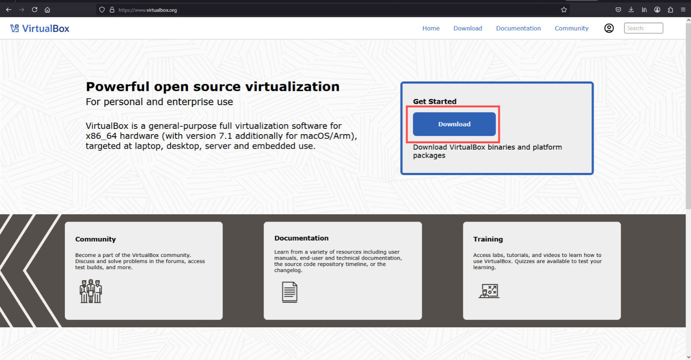

# 1. Guía de Instalación de VirtualBox en Windows

## 1.1 ¿Qué es VirtualBox?

VirtualBox es un software de virtualización de código abierto desarrollado por Oracle que permite crear y ejecutar máquinas virtuales en un ordenador.

### 1.1.1 Características principales:
- Multiplataforma (Windows, Linux, macOS, Solaris)
- Soporte para múltiples sistemas operativos invitados
- Virtualización de hardware (CPU, red, almacenamiento)
- Snapshots (instantáneas del estado de la máquina virtual)

## 1.2 Requisitos del sistema

### 1.2.1 Requisitos mínimos:
- Windows 8.1 o superior
- Procesador con soporte de virtualización
- 4 GB de RAM mínimo

### 1.2.2 Requisitos recomendados:
- Windows 10/11
- 8 GB de RAM o más
- SSD para mejor rendimiento

## 2. Pasos para instalar VirtualBox en Windows

### 2.1 Descargar el instalador

1. Visita el sitio oficial: [https://www.virtualbox.org/](https://www.virtualbox.org/)
2. Haz clic en "Download VirtualBox"
3. Selecciona "Windows hosts"

### 2.2 Ejecutar el instalador

1. Localiza el archivo .exe descargado
2. Haz doble clic para iniciar
3. Confirma el control de cuentas de usuario

### 2.3 Asistente de instalación

#### 2.3.1 Configuración inicial:
1. Ventana de bienvenida → "Next"
2. Selección de componentes → Dejar valores por defecto

#### 2.3.2 Opciones avanzadas:
1. Ubicación de instalación → Predeterminada
2. Crear acceso directo → Opcional
3. Advertencia de red → "Yes"

### 2.4 Completar la instalación

#### 2.4.1 Proceso de instalación:
1. Haz clic en "Install"
2. Acepta los controladores que solicite Windows
3. Espera a que finalice (varios minutos)

#### 2.4.2 Finalización:
1. Haz clic en "Finish"
2. Opción para iniciar VirtualBox automáticamente

### 2.5 Verificar la instalación

1. Abre VirtualBox desde el menú Inicio
2. Confirma que la interfaz principal se muestra correctamente

## 3. Primeros pasos con VirtualBox

### 3.1 Crear una máquina virtual

1. Haz clic en "Nueva"
2. Configuración básica:
   - Nombre
   - Tipo de SO
   - Versión

### 3.2 Asignar recursos

1. Memoria RAM (mínimo 2048 MB)
2. Disco duro virtual (VDI recomendado)
3. Tamaño del disco (20GB mínimo para sistemas modernos)

## 4. Consideraciones adicionales

### 4.1 Optimización
- Habilita virtualización en BIOS/UEFI
- Instala Guest Additions

### 4.2 Solución de problemas
- Error VT-x/AMD-V: Habilitar en BIOS
- Problemas de red: Reinstalar adaptadores de red virtuales

## 5. Conclusión

VirtualBox proporciona una solución completa de virtualización con una instalación sencilla en Windows.
