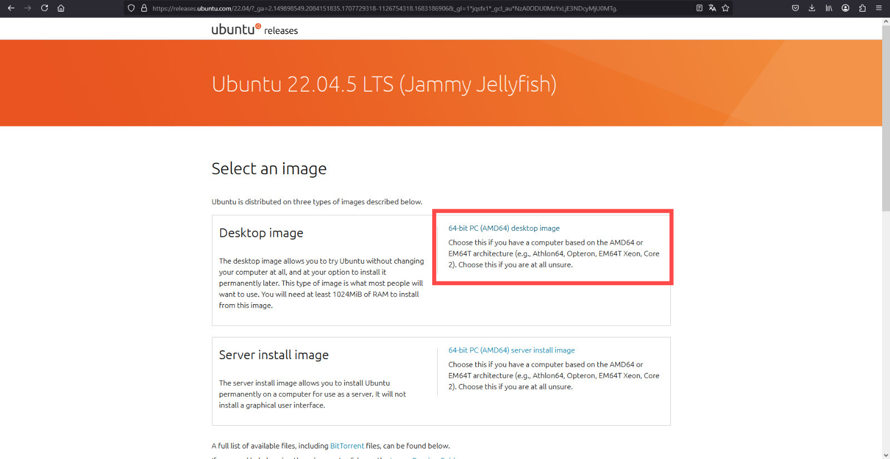

# 1. Guía de Instalación de Linux Ubuntu en VirtualBox

## 1.1 Introducción a Linux Ubuntu

### 1.1.1 ¿Qué es Linux Ubuntu?
**Ubuntu** es una distribución del sistema operativo Linux basada en Debian. Es conocida por su facilidad de uso, estabilidad, seguridad y gran comunidad de soporte. Es ampliamente utilizada tanto por usuarios nuevos como avanzados.

### 1.1.2 Características principales
- Entorno de escritorio GNOME por defecto (aunque también están disponibles variantes como KDE, Xfce y MATE).
- Alta compatibilidad con hardware moderno.
- Gran cantidad de software libre y de código abierto disponible.
- Centro de software intuitivo para instalar aplicaciones fácilmente.
- Soporte a largo plazo (LTS) con actualizaciones de seguridad durante cinco años.


## 1.2 Requisitos del sistema

| Componente     | Mínimo        | Recomendado     |
|----------------|---------------|-----------------|
| RAM            | 2 GB          | 4 GB o más      |
| Almacenamiento | 25 GB         | 30 GB o más     |
| CPU            | Dual-core 2 GHz | Quad-core o superior |


## 2. Preparación para la instalación

### 2.1 Descargar Linux Ubuntu
1. Visitar la página de [descarga ](https://releases.ubuntu.com/22.04/?_ga=2.149898549.2084151835.1707729318-1126754318.1683186906&_gl=1*jqsfx1*_gcl_au*NzA0ODU0MzYxLjE3NDcyMjU0MTg)
2. Seleccionar versión (Cinnamon recomendada)
3. Descargar imagen ISO (~4GB)



### 2.2 Configurar VirtualBox
1. Abrir VirtualBox
2. Click en "Nueva"
3. Nombre: "Ubuntu"
4. Tipo: Linux
5. Versión: Ubuntu (64-bit)


## 3. Configuración de la máquina virtual

### 3.1 Asignación de recursos
1. Memoria RAM: 4096 MB (para buen rendimiento)
2. Disco duro: 25 GB (VDI, asignación dinámica)

### 3.2 Configuración adicional
1. Procesadores: 2 CPUs
2. Aceleración: Habilitar VT-x/AMD-V
3. Gráficos: 128 MB VRAM

## 4. Proceso de instalación

### 4.1 Iniciar la instalación
1. Seleccionar ISO descargada
2. Iniciar máquina virtual
3. Elegir "Start Linux Ubuntu"


### 4.2 Instalación paso a paso

#### 4.2.1 Configuración inicial
1. Doble-click en "Install Linux Ubuntu
2. Seleccionar idioma
3. Distribución de teclado

#### 4.2.2 Particionado de disco
1. Elegir "Borrar disco e instalar Linux Ubuntu"
2. Confirmar escritura de cambios

#### 4.2.3 Configuración regional
1. Seleccionar zona horaria
2. Ingresar datos de usuario:
   - Nombre completo
   - Nombre de equipo
   - Contraseña


## 5. Post-instalación

### 5.1 Primeros pasos
1. Reiniciar la máquina virtual
2. Remover medio de instalación
3. Iniciar sesión

### 5.2 Instalar Guest Additions
1. Menú Devices > Insert Guest Additions CD image
2. Ejecutar desde la terminal:
```bash
sudo apt update
sudo apt install build-essential dkms linux-headers-$(uname -r)
sudo ./VBoxLinuxAdditions.run
```

### 5.3 Actualizar sistema
```bash
sudo apt update && sudo apt upgrade -y
```

## 6. Personalización básica

### 6.1 Ajustes iniciales
1. Configurar resolución de pantalla
2. Habilitar efectos de escritorio
3. Personalizar panel inferior

### 6.2 Software recomendado
- Firefox (preinstalado)
- LibreOffice (suite ofimática)
- GIMP (edición de imágenes)
- VLC (reproductor multimedia)

## 7. Solución de problemas comunes

### 7.1 Problemas de pantalla
- Cambiar controlador gráfico a VBoxSVGA
- Aumentar memoria de video

### 7.2 Problemas de red
- Verificar configuración de adaptador (NAT recomendado)
- Reiniciar servicio de red:
```bash
sudo service network-manager restart
```

## 8. Conclusión

Ubuntu ofrece una excelente experiencia de usuario en VirtualBox:
- Fácil instalación
- Buen rendimiento general
- Ideal para principiantes en Linux
- Amplio soporte de la comunidad
- Alternativa libre a sistemas operativos comerciales

### 8.1 Recursos adicionales
- [Documentación oficial de Ubuntu](https://help.ubuntu.com/)
- [Comunidad Ubuntu en español](https://ubuntuespana.org/)
- [Ask Ubuntu (preguntas y respuestas)](https://askubuntu.com/)
- Encuentre una guia completa de la invitación de virtualbox y ubuntu en [geeksforgeeks](https://www.geeksforgeeks.org/how-to-install-ubuntu-on-virtualbox/)

